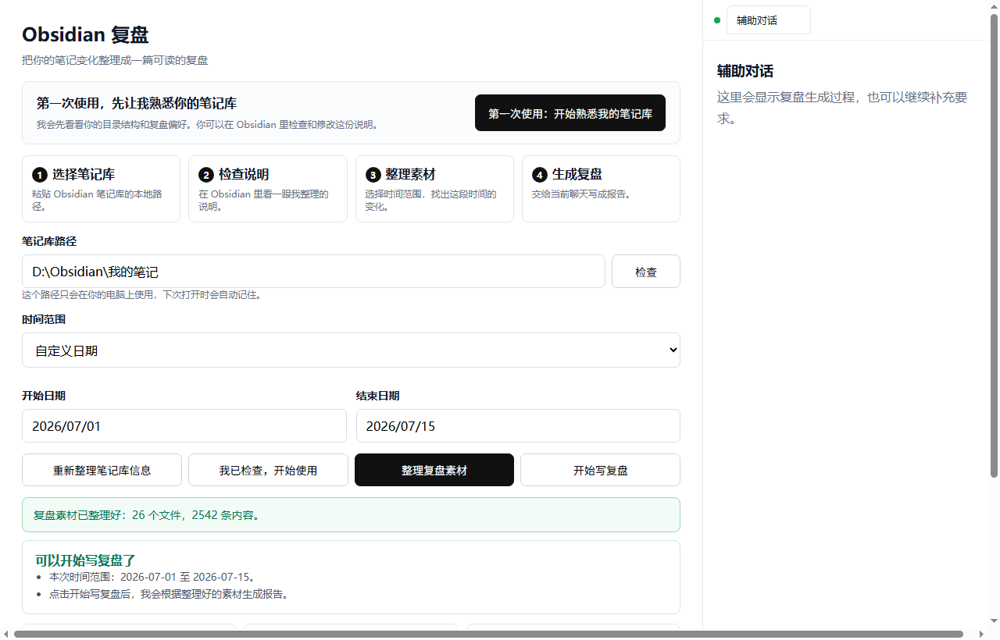
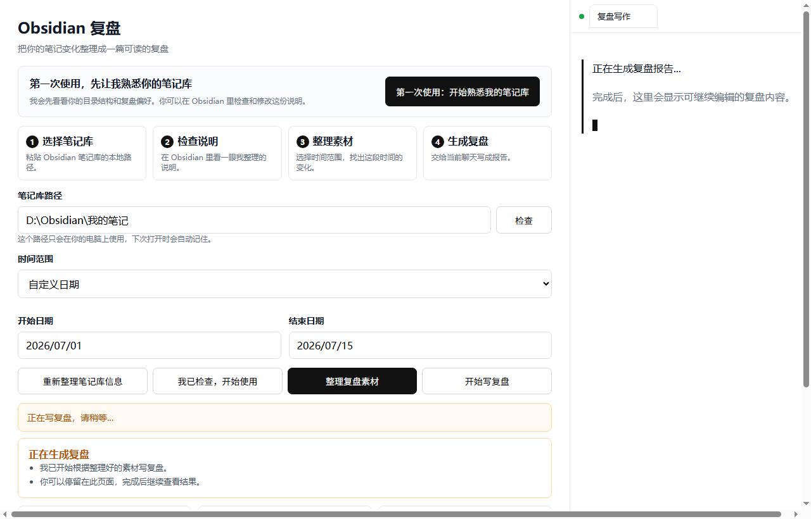

# Personal Review Agent

Personal Review Agent 是一个面向个人 Obsidian 笔记的复盘助手。

它会帮你从一段时间内修改过的笔记中整理出重点内容，再生成一篇适合回看和继续行动的复盘报告。你可以用它做周复盘、月复盘，也可以为某个项目、学习阶段或自定义日期范围整理阶段总结。

## 适合谁使用

如果你平时用 Obsidian 记录这些内容，它会很适合你：

- 项目进展、实验记录、研究思路
- 论文阅读、课程学习、知识整理
- 面试准备、工作记录、阶段计划
- 日记、灵感、问题清单和待办事项

你不需要手动翻很多笔记。选择一个时间范围后，它会先整理素材，再帮你写成一篇结构化复盘。

## 界面预览

主界面围绕复盘流程设计：选择笔记库、整理素材、生成复盘都在同一个工作台里完成。



生成复盘时，页面会显示当前进度。完成后，你可以在右侧对话栏继续补充要求，或查看生成结果。



## 主要功能

- 第一次使用时，先了解你的笔记库结构和复盘偏好。
- 支持今天、本周、上周、本月和自定义日期范围。
- 按文件最后修改时间整理复盘素材。
- 自动跳过 Obsidian 配置目录、复盘输出目录和带忽略标签的笔记。
- 生成可读的 Markdown 复盘报告，并保存到你的 Obsidian 笔记库中。
- 提供本地图形界面，也保留命令行使用方式。

## 快速开始

推荐使用 Python 3.11 或 3.12。

### 1. 下载项目

```powershell
git clone https://github.com/jasmineyg/personal-review-agent.git
cd Personal-review-agent
```

### 2. 安装依赖

推荐使用 `uv`：

```powershell
uv venv
uv pip install -e ".[ui]"
```

也可以使用普通虚拟环境：

```powershell
python -m venv .venv
.\.venv\Scripts\activate
pip install -e ".[ui]"
```

### 3. 配置模型

复制配置模板：

```powershell
copy mykey_template.py mykey.py
```

打开 `mykey.py`，填入你自己的模型 API Key 和模型配置。

`mykey.py` 只用于本地配置，请不要提交到 Git。

### 4. 启动图形界面

```powershell
python launch.pyw
```

启动后会打开本地页面，地址通常是：

```text
http://127.0.0.1:14168/
```

## 第一次使用

第一次使用时，需要先让工具熟悉你的笔记库：

1. 在“笔记库路径”中填写 Obsidian 笔记库的本地路径。
2. 点击“第一次使用：开始熟悉我的笔记库”。
3. 工具会在 Obsidian 中生成一份说明文件。
4. 打开这份说明，检查它对目录结构、主题和复盘偏好的理解。
5. 修改或确认后，回到界面点击“我已检查，开始使用”。

完成这一步后，之后就可以直接整理复盘素材。

## 日常复盘流程

1. 选择时间范围。
2. 点击“整理复盘素材”。
3. 查看找到的文件数和内容数。
4. 点击“开始写复盘”。
5. 等待生成完成，在右侧查看结果。
6. 打开保存位置，在 Obsidian 中继续编辑或归档报告。

当前版本按文件的“最后修改时间”选择复盘素材。只要 Markdown 文件的最后修改时间落在所选范围内，就会进入本次复盘素材。

## 文件保存位置

工具会在你的 Obsidian 笔记库中创建这些位置：

```text
.obsidian-review-agent/      工具运行状态和整理结果
Reviews/                    复盘报告默认保存位置
Reviews/_AgentProfile/      第一次使用时生成的说明文件
```

通常你只需要通过界面里的“打开”按钮访问这些文件。

## 忽略规则

默认会跳过这些目录：

```text
.obsidian
.trash
.obsidian-review-agent
Reviews
```

带有以下标签的笔记也会被跳过：

```text
#private
#secret
#ignore-review
#no-review
```

如果有不想进入复盘的笔记，可以给它加上忽略标签。

## 命令行使用

如果不想使用图形界面，也可以直接用命令行。

本周复盘：

```powershell
python -m memory.obsidian_review.obsidian_review prepare --vault "D:\Obsidian\我的笔记" --period this-week
```

自定义日期：

```powershell
python -m memory.obsidian_review.obsidian_review prepare --vault "D:\Obsidian\我的笔记" --from 2026-07-01 --to 2026-07-15
```

终端界面：

```powershell
python frontends/tui_v3.py
```

## 常见问题

### 为什么没有找到素材？

可以按下面顺序检查：

- 日期范围是否选对。
- 笔记文件的最后修改时间是否在这个范围内。
- 文件是否是 Markdown 文件。
- 文件是否位于默认跳过的目录中。
- 文件是否包含忽略标签。

### 为什么第一次使用需要检查说明？

每个人的 Obsidian 目录结构都不一样。先检查说明，可以让工具更准确地理解你的主题、项目和复盘偏好，后续生成的报告也会更贴近你的使用习惯。

### 会修改我的原始笔记吗？

整理素材时不会改写你的原始笔记。生成复盘后，报告会保存到 `Reviews/` 目录，你可以在 Obsidian 中继续编辑。

## 隐私说明

- 笔记扫描和素材整理在你的电脑本地完成。
- 模型密钥保存在本地 `mykey.py` 中。
- 生成复盘时，整理后的素材会发送给你配置的模型服务，用于生成报告。
- 你可以通过忽略目录和忽略标签控制哪些笔记不参与复盘。

## 和 GenericAgent 的关系

Personal Review Agent 基于 [GenericAgent](https://github.com/lsdefine/GenericAgent) 改造而来。GenericAgent 提供了本地 Agent、命令行和前端基础能力；这个分支把主要体验聚焦在个人 Obsidian 复盘工作流上。

## License

MIT
